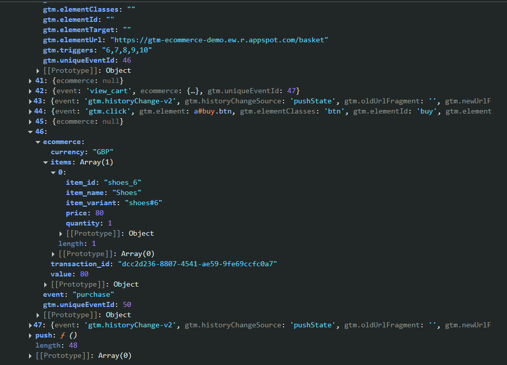

# GTM - Implementación de Funnel de E-commerce Completo

## Configuración de eventos del funnel de compra

Este documento constituye la segunda fase de nuestra implementación de Google Tag Manager para e-commerce. Continuando con el tracking de `view_item` y `select_item` del primer proyecto, ahora configuraremos los eventos críticos del proceso de compra para completar el funnel de conversión.

Implementaremos tres eventos fundamentales que capturan las acciones más importantes del usuario en su journey de compra: **Add to Cart** rastrea cuando los usuarios añaden productos al carrito, indicando intención de compra clara; **View Cart** mide el engagement con el contenido del carrito y permite analizar abandono; **Purchase** registra las conversiones completadas, proporcionando datos esenciales de ingresos y transaction ID únicos para evitar duplicaciones.

La ventaja de esta web demo es que los eventos de e-commerce ya están implementados automáticamente en el dataLayer, permitiendo una configuración robusta sin depender de clics complejos.

## Inspección de datos disponibles

Antes de configurar las etiquetas en GTM, es esencial identificar qué datos están disponibles en el dataLayer para los nuevos eventos del funnel de compra.

### Localización del evento add_to_cart

1. Navegar a cualquier página de producto: `/product/shoes`, `/product/blazer`, o `/product/tshirt`
2. Hacer clic en el botón **"Add to Basket"**
3. Abrir herramientas de desarrollador (`F12`)
4. En la pestaña **Console**, ejecutar: `dataLayer`
5. Buscar el objeto que contiene `event: "add_to_cart"`
6. Anotar la posición del evento en el array

### Localización del evento view_cart

1. Añadir al menos un producto al carrito usando el proceso anterior
2. Navegar a la página del carrito: `/basket`
3. En la pestaña **Console**, ejecutar: `dataLayer`
4. Buscar el objeto que contiene `event: "view_cart"`

### Localización del evento purchase

1. Completar una compra (desde carrito o compra directa)
2. En la página de confirmación `/thank-you`
3. En la pestaña **Console**, ejecutar: `dataLayer`
4. Buscar el objeto que contiene `event: "purchase"`



### Uso de ejemplos reales de dataLayer

Utilizaremos ejemplos de datos reales capturados durante las pruebas porque demuestran funcionamiento real, facilitan debugging al permitir comparar resultados, muestran la estructura completa incluyendo todos los campos, y proporcionan contexto tangible para comprensión.

**Importante**: Estos son ejemplos de una sesión específica de pruebas. En producción, los valores cambiarán dinámicamente según el producto y comportamiento de cada usuario.

### Estructura de datos de los eventos

#### Add to Cart
```javascript
{
  event: "add_to_cart",
  ecommerce: {
    currency: "GBP",
    value: 80,
    items: [{
      item_id: "shoes_6",
      item_name: "Shoes",
      item_variant: "shoes#6",
      price: 80,
      quantity: 1
    }]
  }
}
```

#### View Cart
```javascript
{
  event: "view_cart",
  ecommerce: {
    currency: "GBP",
    value: 350,
    items: [
      {item_id: 'shoes_6', item_name: 'Shoes', price: 80, quantity: 4, item_variant: 'shoes#6'},
      {item_id: 'tshirt_m', item_name: 'T-Shirt', price: 30, quantity: 1, item_variant: 'tshirt#M'}
    ]
  }
}
```

#### Purchase
```javascript
{
  event: "purchase",
  ecommerce: {
    currency: "GBP",
    value: 30,
    transaction_id: "e9dc5432-1ee6-489e-9151-183dadd8550f",
    items: [{
      item_id: "tshirt_m",
      item_name: "T-Shirt",
      item_variant: "tshirt#M",
      price: 30,
      quantity: 1
    }]
  }
}
```

Para nuestras etiquetas GA4, utilizaremos los mismos campos base (ecommerce.currency, ecommerce.value, ecommerce.items) y añadiremos campos específicos como transaction_id para el evento purchase. El campo transaction_id es crítico para identificar de forma única cada transacción y evitar duplicaciones.


## Elementos HTML del proyecto

### Contexto de las páginas de e-commerce

Los elementos que configuraremos para el tracking se encuentran distribuidos en diferentes páginas del flujo de compra:

- **Páginas de producto individual**: `/product/shoes`, `/product/blazer`, `/product/tshirt`
- **Página de listado de productos**: `/products`
- **Página del carrito**: `/basket`
- **Página de confirmación**: `/thank-you`

### Estructura HTML de los elementos

#### Botón "Add to Basket"
```html
<a _ngcontent-ng-c270764084 class="btn add-to-basket"> Add to Basket </a>
```

**Características clave:**
- **Clase CSS**: `add-to-basket` (para identificación específica)
- **Ubicación**: Páginas de producto individual
- **Funcionalidad**: Genera automáticamente el evento `add_to_cart` en el dataLayer

#### Botón "Buy" desde lista de productos
```html
<a _ngcontent-ng-c1551801819 class="btn buy-one-click">Buy</a>
```

**Características clave:**
- **Clase CSS**: `buy-one-click` (compra directa)
- **Ubicación**: Página de listado `/products`
- **Funcionalidad**: Permite compra directa sin pasar por el carrito

#### Botón "Buy" desde carrito
```html
<a _ngcontent-ng-c333843712 id="buy" routerlink="/thank-you" class="btn" href="/thank-you">Buy</a>
```

**Características clave:**
- **ID**: `buy` (identificador único)
- **Ubicación**: Página del carrito `/basket`
- **Funcionalidad**: Procesa la compra de todos los productos en el carrito

### Relación con el DataLayer

El sistema de e-commerce de la web genera automáticamente los eventos correspondientes cuando el usuario interactúa con estos elementos, manteniendo sincronización entre las acciones del usuario y los datos enviados a GA4.


## Configuración en GTM

### Variables de capa de datos

Además de las variables ya creadas en el proyecto anterior (ecommerce.currency, ecommerce.value, ecommerce.items.0.item_name, ecommerce.items), necesitamos crear variables adicionales para los nuevos eventos.

#### Variable: ecommerce.transaction_id
- **Nombre**: `ecommerce.transaction_id`
- **Tipo**: Variable de capa de datos
- **Versión**: 2
- **Nombre de variable de capa de datos**: `ecommerce.transaction_id`

Esta variable es crítica para el evento purchase ya que permite identificar de forma única cada transacción y evitar duplicaciones en los reportes.


#### Variable: ecommerce.items.0.item_id
- **Nombre**: `ecommerce.items.0.item_id`
- **Tipo**: Variable de capa de datos
- **Versión**: 2
- **Nombre de variable de capa de datos**: `ecommerce.items.0.item_id`

Captura el identificador único del producto, que incluye información sobre la variante seleccionada.


#### Variable: ecommerce.items.0.item_variant
- **Nombre**: `ecommerce.items.0.item_variant`
- **Tipo**: Variable de capa de datos
- **Versión**: 2
- **Nombre de variable de capa de datos**: `ecommerce.items.0.item_variant`

Información adicional sobre la variante del producto, útil para análisis detallados de preferencias.


#### Variable: ecommerce.items.0.quantity
- **Nombre**: `ecommerce.items.0.quantity`
- **Tipo**: Variable de capa de datos
- **Versión**: 2
- **Nombre de variable de capa de datos**: `ecommerce.items.0.quantity`

Cantidad de productos en el evento, especialmente importante para análisis de volumen de compra.


### Activadores

La configuración requiere cuatro activadores específicos: tres para los eventos automáticos del dataLayer y uno de respaldo basado en pageview para el evento purchase.

#### Activador: Custom Event - Add to Cart

- **Nombre**: `Custom Event - Add to Cart`
- **Tipo**: Evento personalizado
- **Nombre del evento**: `add_to_cart`

Este activador se dispara automáticamente cuando el dataLayer recibe un evento con el nombre `add_to_cart`. No requiere configuración de clics ya que el evento se genera automáticamente por el sistema de e-commerce.


#### Activador: Custom Event - View Cart

- **Nombre**: `Custom Event - View Cart`
- **Tipo**: Evento personalizado
- **Nombre del evento**: `view_cart`

Se activa cuando el usuario navega a la página del carrito, ya que el sistema genera automáticamente el evento correspondiente en el dataLayer.


#### Activador: Custom Event - Purchase

- **Nombre**: `Custom Event - Purchase`
- **Tipo**: Evento personalizado
- **Nombre del evento**: `purchase`

Activador principal para las compras, que se dispara cuando el dataLayer recibe el evento de purchase desde el sistema de e-commerce.


#### Activador: Page View - Thank You Page

- **Nombre**: `Page View - Thank You Page`
- **Tipo**: Vista de página
- **Se activa en**: Algunas vistas de página
- **Condiciones**:
  - Campo: `{{Page Path}}`
  - Operador: `contiene`
  - Valor: `/thank-you`

Este activador funciona como respaldo para el evento purchase. Si por algún motivo el evento personalizado no se dispara, garantizamos el tracking de la compra mediante la carga de la página de confirmación.

### Etiquetas GA4

#### Etiqueta: GA4 - Add to Cart

- **Nombre**: `GA4 - Add to Cart`
- **Tipo**: Evento de Google Analytics 4
- **ID de medición**: `{{GA4 Measurement ID}}`
- **Nombre del evento**: `add_to_cart`

**Parámetros del evento**:
- `currency`: `{{ecommerce.currency}}`
- `value`: `{{ecommerce.value}}`

**Configuración de parámetros de elementos**:
- **Enviar un parámetro de elemento de comercio electrónico**: Habilitado
- **Elementos**: `{{ecommerce.items}}`

**Activadores**:
- `Custom Event - Add to Cart`

Al habilitar los parámetros de elementos y usar la variable `{{ecommerce.items}}`, GA4 procesará automáticamente toda la información de productos incluida en el array.


#### Etiqueta: GA4 - View Cart

- **Nombre**: `GA4 - View Cart`
- **Tipo**: Evento de Google Analytics 4
- **ID de medición**: `{{GA4 Measurement ID}}`
- **Nombre del evento**: `view_cart`

**Parámetros del evento**:
- `currency`: `{{ecommerce.currency}}`
- `value`: `{{ecommerce.value}}`

**Configuración de parámetros de elementos**:
- **Enviar un parámetro de elemento de comercio electrónico**: Habilitado
- **Elementos**: `{{ecommerce.items}}`

**Activadores**:
- `Custom Event - View Cart`

Esta configuración permite trackear el contenido completo del carrito, incluyendo múltiples productos y sus cantidades.


#### Etiqueta: GA4 - Purchase

- **Nombre**: `GA4 - Purchase`
- **Tipo**: Evento de Google Analytics 4
- **ID de medición**: `{{GA4 Measurement ID}}`
- **Nombre del evento**: `purchase`

**Parámetros del evento**:
- `currency`: `{{ecommerce.currency}}`
- `value`: `{{ecommerce.value}}`
- `transaction_id`: `{{ecommerce.transaction_id}}`

**Configuración de parámetros de elementos**:
- **Enviar un parámetro de elemento de comercio electrónico**: Habilitado
- **Elementos**: `{{ecommerce.items}}`

**Activadores**:
- `Custom Event - Purchase`

El parámetro `transaction_id` es fundamental para evitar contabilizar la misma compra múltiples veces.


## Testing y validación

### Configuración de vista previa

1. En GTM → Botón **"Vista previa"** (esquina superior derecha)
2. URL de prueba: `https://gtm-ecommerce-demo.ew.r.appspot.com/`
3. Hacer clic en **"Connect"**


### Escenarios de prueba

#### Escenario 1: Evento Add to Cart
1. Navegar a cualquier página de producto: `/product/shoes`, `/product/blazer`, o `/product/tshirt`
2. Localizar el botón **"Add to Basket"**
3. Hacer clic en el botón

**Comprobaciones en GTM Preview:**
- ✅ El evento `Custom Event - Add to Cart` aparece en la lista de eventos disparados
- ✅ La etiqueta `GA4 - Add to Cart` se ejecuta exitosamente
- ✅ Las variables se populan correctamente:
  - `{{ecommerce.currency}}` muestra "GBP"
  - `{{ecommerce.value}}` muestra el precio del producto
  - `{{ecommerce.items}}` contiene el array con los datos del producto


#### Escenario 2: Evento View Cart
1. Añadir al menos un producto al carrito usando el proceso anterior
2. Hacer clic en el ícono del carrito o navegar directamente a: `/basket`

**Comprobaciones en GTM Preview:**
- ✅ El evento `Custom Event - View Cart` se dispara automáticamente al cargar la página
- ✅ La etiqueta `GA4 - View Cart` se ejecuta
- ✅ El array `{{ecommerce.items}}` contiene todos los productos del carrito
- ✅ La variable `{{ecommerce.value}}` refleja el total correcto del carrito


#### Escenario 3: Evento Purchase (compra directa)
1. Desde la lista de productos, hacer clic directamente en cualquier botón **"Buy"**
2. Serás redirigido a la página `/thank-you`

**Comprobaciones en GTM Preview:**
- ✅ El evento `Custom Event - Purchase` se dispara
- ✅ La etiqueta `GA4 - Purchase` se ejecuta exitosamente
- ✅ La variable `{{ecommerce.transaction_id}}` contiene un ID único
- ✅ Los datos de productos comprados aparecen correctamente en `{{ecommerce.items}}`


#### Escenario 4: Evento Purchase (desde carrito)
1. Añadir productos al carrito
2. Ir a la página del carrito `/basket`
3. Hacer clic en el botón **"Buy"**
4. Serás redirigido a la página `/thank-you`

**Comprobaciones en GTM Preview:**
- ✅ El evento `Custom Event - Purchase` se dispara
- ✅ La etiqueta `GA4 - Purchase` se ejecuta exitosamente
- ✅ Si hay problemas con el evento personalizado, la etiqueta `GA4 - Purchase Backup` se activa
- ✅ Los datos de múltiples productos aparecen en el array `{{ecommerce.items}}`


### Verificaciones en GTM Preview

#### Para Add to Cart:
- ✅ Se dispara al hacer clic en "Add to Basket"
- ✅ Variables se cargan correctamente:
  - `ecommerce.currency`: GBP
  - `ecommerce.value`: Precio del producto
  - `ecommerce.items.0.item_name`: Nombre del producto
- ✅ Etiqueta "GA4 - Add to Cart" se marca como "Fired"

#### Para View Cart:
- ✅ Se dispara automáticamente al cargar página `/basket`
- ✅ Variables reflejan contenido completo del carrito
- ✅ Valor total coincide con suma de productos
- ✅ Etiqueta "GA4 - View Cart" se marca como "Fired"

#### Para Purchase:
- ✅ Se dispara al completar compra
- ✅ Variable `transaction_id` contiene valor único
- ✅ Datos de productos comprados son correctos
- ✅ Etiqueta "GA4 - Purchase" se marca como "Fired"


### Verificación en GA4

#### Informes en tiempo real
1. Acceder a GA4 → **Informes** → **Tiempo real**
2. Realizar las pruebas siguiendo los escenarios descritos
3. Verificar que aparecen los eventos:
   - `add_to_cart` (al añadir productos al carrito)
   - `view_cart` (al visualizar el carrito)
   - `purchase` (al completar compras)


#### Verificación de parámetros por evento

**Para verificar add_to_cart:**
1. Hacer clic en el evento `add_to_cart` en la lista
2. Verificar que aparecen los parámetros:
   - `currency` (debe coincidir con "GBP")
   - `value` (debe coincidir con el precio del producto)
   - `item_name` (debe coincidir con el nombre del producto)

**Para verificar view_cart:**
1. Hacer clic en el evento `view_cart` en la lista
2. Verificar que aparecen los parámetros:
   - `currency` (debe coincidir con "GBP")
   - `value` (debe coincidir con el total del carrito)
   - Múltiples productos si el carrito contiene varios items

**Para verificar purchase:**
1. Hacer clic en el evento `purchase` en la lista
2. Verificar que aparecen los parámetros:
   - `currency` (debe coincidir con "GBP")
   - `value` (debe coincidir con el total de la compra)
   - `transaction_id` (debe mostrar un ID único)
   - `item_name` (debe coincidir con los productos comprados)

## Resolución de problemas comunes

### Variables de transaction_id vacías
**Causa**: La variable transaction_id solo se popula en eventos de purchase.

**Solución**: 
1. Verificar que el evento `purchase` existe en el dataLayer de la página `/thank-you`
2. Confirmar que la compra se ha completado correctamente
3. Revisar que la variable está configurada con la versión 2 de dataLayer

### Datos de carrito incompletos
**Verificación**:
1. Confirmar que el carrito contiene productos antes de realizar la prueba
2. Verificar que el evento `view_cart` se genera al cargar la página del carrito
3. Inspeccionar el dataLayer para confirmar que el array `items` contiene todos los productos

## Proceso de publicación

### Pasos para publicar la configuración

1. **Salir del modo Preview**: Hacer clic en "Salir del modo de vista previa" en GTM
2. **Crear versión**: Botón **"Enviar"** en la esquina superior derecha
3. **Configurar la versión**:
   - **Nombre de la versión**: `Implementación Funnel E-commerce Completo`
   - **Descripción de la versión**:
   ```
   - Añadidas etiquetas GA4 para eventos add_to_cart, view_cart y purchase
   - Configuradas variables adicionales de e-commerce (transaction_id, item_id, item_variant, quantity)
   - Implementados activadores para eventos automáticos de e-commerce
   - Creada etiqueta de respaldo para purchase basada en pageview
   - Validado funcionamiento completo del funnel de conversión
   ```
4. **Publicar**: Hacer clic en **"Publicar"**


### Verificación post-publicación

Una vez publicada la versión:

- **Quitar parámetros de preview** de la URL del sitio
- **Repetir escenarios de prueba** sin modo preview activo
- **Verificar en GA4 tiempo real** que los eventos siguen llegando
- **Confirmar que no hay errores** en la consola del navegador
- **Establecer evento purchase como conversión** en GA4

La implementación estará ahora activa para todos los usuarios del sitio web.

## Métricas de análisis disponibles

Con esta implementación completa del funnel se pueden generar análisis sobre:

- **Funnel de conversión completo** (view_item → add_to_cart → view_cart → purchase)
- **Tasa de abandono del carrito** (view_cart vs purchase)
- **Average Order Value** (valor promedio por transacción)
- **Productos más añadidos al carrito** vs **productos más comprados**
- **Análisis de comportamiento de compra** (directa vs a través del carrito)
- **Revenue tracking** con transaction IDs únicos para evitar duplicaciones