# GTM - Implementación de View Item y Select Item

## Configuración de eventos de producto
En este documento configuraremos dos etiquetas clave para el seguimiento de productos en e-commerce: view_item y select_item. Estas etiquetas son fundamentales para el análisis de e-commerce ya que proporcionan datos críticos sobre el comportamiento del usuario en el funnel de producto, permitiendo medir la efectividad de la presentación de productos y optimizar la experiencia de compra mediante el análisis de patrones de interacción.

**View Item** rastrea automáticamente cuando un usuario visualiza una página de producto individual, proporcionando métricas de engagement por producto. **Select Item** captura las interacciones deliberadas del usuario con productos desde páginas de listado, indicando intención de compra y permitiendo analizar qué elementos (imágenes vs botones) generan mayor conversión.

## Inspección de datos disponibles

Antes de configurar las etiquetas en GTM, es esencial identificar qué datos están disponibles en el dataLayer y cómo acceder a ellos.

### Localización del evento view_item

1. Navegar a cualquier página de producto: `/product/shoes`, `/product/blazer`, o `/product/tshirt`
2. Abrir herramientas de desarrollador (`F12`)
3. En la pestaña **Console**, ejecutar: `dataLayer`
4. Buscar el objeto que contiene `event: "view_item"`
5. Anotar la posición del evento en el array

### Verificación desde Elements

Para confirmar que GTM está correctamente implementado:

- Abrir herramientas del navegador con `F12`
- Ir a la pestaña **Elements**
- Presionar `Ctrl + F` y buscar `GTM-`
- Verificar que aparece el ID del contenedor GTM

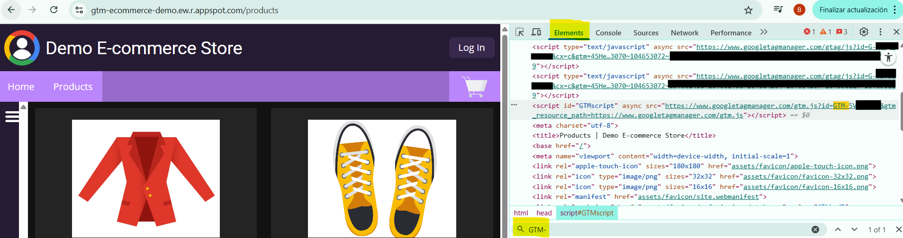

### Inspección desde Console

```javascript
// Verificar que GTM está cargado
window.google_tag_manager

// Verificar que el dataLayer existe
window.dataLayer

// Inspeccionar evento específico (ajustar índice según posición)
dataLayer[14]  // Si el evento view_item está en posición 14
dataLayer[14].ecommerce
```

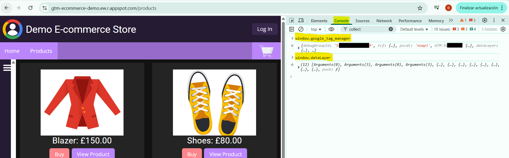

### Estructura de datos del evento

El evento `view_item` contiene la siguiente estructura de datos que utilizaremos en nuestras variables:

```javascript
{
  event: 'view_item',
  ecommerce: {
    currency: 'GBP',
    value: 30,
    items: [{
      item_id: 'tshirt_m',
      item_name: 'T-Shirt',
      price: 30,
      quantity: 1,
      item_variant: 'tshirt#m'
    }]
  }
}
```

El campo `ecommerce.items` es un array que contiene todos los datos estructurados de los productos. Dentro de cada elemento del array encontramos campos como:

`item_id`: Identificador único del producto
`item_name`: Nombre del producto
`price`: Precio del producto
`quantity`: Cantidad
`item_variant`: Variante del producto

Para nuestras etiquetas GA4, utilizaremos ecommerce.currency, ecommerce.value y ecommerce.items.0.item_name como puntos de datos clave. Hemos elegido item_name porque proporciona una identificación clara y legible de los productos en los informes de GA4.

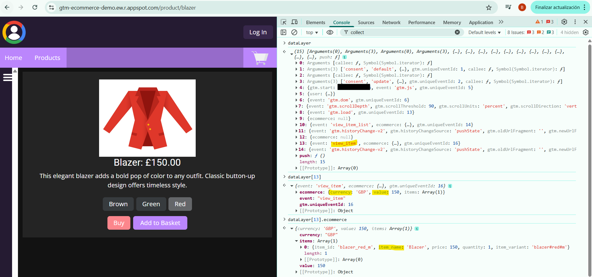

## Elementos HTML del proyecto

### Contexto de la página de productos

Los elementos que configuraremos para el tracking se encuentran en la página de listado de productos: `https://gtm-ecommerce-demo.ew.r.appspot.com/products`

Esta página presenta una cuadrícula de productos donde cada producto está contenido en un recuadro individual que incluye:
- Imagen del producto
- Botón "View Product" 
- Botón "Buy" (que usaremos en proyectos futuros)

### Estructura HTML de los elementos

#### Contenedor del producto
La estructura general sigue el patrón: `<div>` → `<a>` → ``

#### Imagen del producto
```html

```

**Características clave:**
- **Clase CSS**: `product-image` (utilizada por nuestro activador de clics)
- **Atributo alt**: Identifica específicamente cada producto
- **Ubicación**: Dentro de un enlace que redirige a la página de detalle del producto

#### Botón "View Product"
```html
<a _ngcontent-ng-c1551801819 class="btn" href="/product/tshirt">View Product</a>
```

**Características clave:**
- **Clase CSS**: `btn` (utilizada por nuestro activador de clics)
- **Texto del enlace**: "View Product" (capturado por la variable `{{Click Text}}`)
- **Destino**: URL específica del producto (`/product/tshirt`, `/product/shoes`, `/product/blazer`)

### Relación con el DataLayer

Cuando el usuario interactúa con estos elementos desde la página `/products`:

1. **Al hacer clic en la imagen o botón**: Se dispara el evento `select_item`
2. **Al cargar la página de destino**: Se dispara automáticamente el evento `view_item` con los datos del producto específico

El dataLayer se actualiza automáticamente con la información del producto correspondiente, manteniendo consistencia entre la interacción del usuario y los datos enviados a GA4.

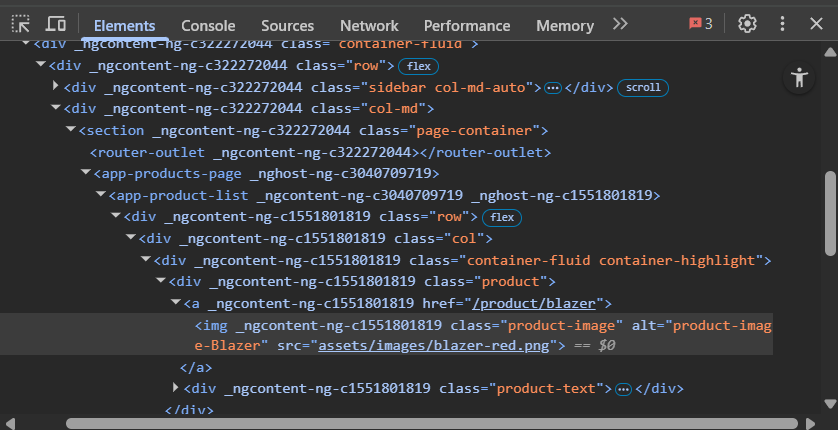

## Configuración en GTM

### Variables de capa de datos

Creamos variables específicas para extraer los datos del evento ecommerce. Utilizamos **Variables de capa de datos** porque son el tipo específico para extraer información del dataLayer de GTM. Configuramos la **versión 2** (más robusta que la versión 1) ya que busca el valor en todo el historial del dataLayer en lugar de solo en el momento exacto del disparo, proporcionando mayor confiabilidad.

#### Variable: ecommerce.currency
- **Nombre**: `ecommerce.currency`
- **Tipo**: Variable de capa de datos
- **Versión**: 2
- **Nombre de variable de capa de datos**: `ecommerce.currency`

#### Variable: ecommerce.value
- **Nombre**: `ecommerce.value`
- **Tipo**: Variable de capa de datos  
- **Versión**: 2
- **Nombre de variable de capa de datos**: `ecommerce.value`

#### Variable: ecommerce.items.0.item_name
- **Nombre**: `ecommerce.items.0.item_name`
- **Tipo**: Variable de capa de datos
- **Versión**: 2
- **Nombre de variable de capa de datos**: `ecommerce.items.0.item_name`

La notación `.0.` específica es necesaria porque `items` es un array y necesitamos acceder al primer elemento (índice 0) para obtener el nombre del producto.

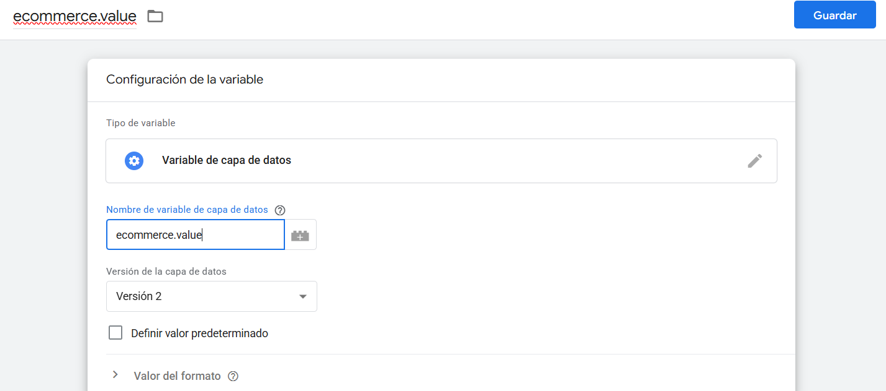

#### Variable: Click Source (para Select Item)


Aunque GTM ofrece variables incorporadas como Click Classes o Click Element, creamos esta función personalizada para obtener valores semánticos específicos ('product_image', 'view_button') en lugar de datos técnicos brutos. Esto facilita el análisis posterior en GA4 al proporcionar etiquetas descriptivas consistentes, y centraliza la lógica de identificación en una sola variable reutilizable.


Esta variable personalizada identifica el origen del clic, permitiendo distinguir si el usuario interactuó con la imagen del producto o el botón de vista desde la página de listado.

- **Nombre**: `Click Source`
- **Tipo**: Variable personalizada de JavaScript
- **Código**:

```javascript
function() {
  var clickClasses = {{Click Classes}};
  if (clickClasses && clickClasses.indexOf('product-image') !== -1) {
    return 'product_image';
  } else if (clickClasses && clickClasses.indexOf('btn') !== -1) {
    return 'view_button';
  } else {
    return 'unknown';
  }
}
```
**Explicación de la función:**
1. **`{{Click Classes}}`** es una variable incorporada de GTM que captura las clases CSS del elemento clickeado
2. **`indexOf('product-image')`** busca si la clase 'product-image' existe en el string de clases
3. **Devuelve valores específicos** según el tipo de elemento: 'product_image' para imágenes, 'view_button' para botones
4. **Caso por defecto 'unknown'** para clics que no coincidan con ningún patrón esperado

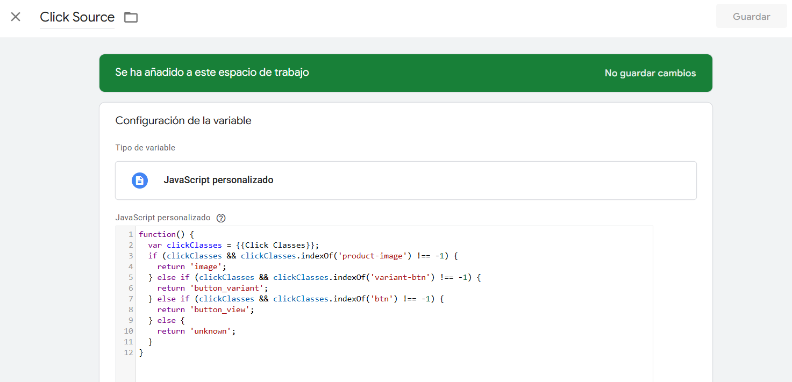

### Activadores

La configuración requiere tres activadores específicos: uno para el evento automático view_item y dos para las diferentes formas de interacción que generan select_item.

#### Activador: Custom Event- View Item

Para el evento automático `view_item`:

- **Nombre**: `Custom Event - View Item`
- **Tipo**: Evento personalizado
- **Nombre del evento**: `view_item`

Este activador se dispara automáticamente cuando se detecta el evento `view_item` en el dataLayer, proporcionando una activación más precisa que depende directamente de los datos estructurados de e-commerce en lugar de la URL de la página.

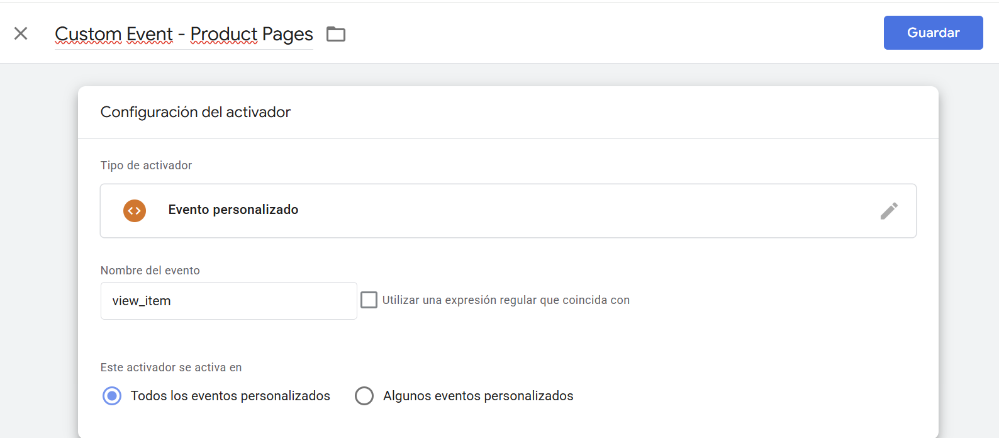 ***captura pentiende***

#### Activador: Click - Product Image

Para el evento `select_item` cuando el usuario hace clic en la imagen del producto:

- **Nombre**: `Click - Product Image`
- **Tipo**: Clic - Todos los elementos
- **Se activa en**: Algunos clics
- **Condiciones**:
  - Campo: `{{Click Classes}}`
  - Operador: `contiene`
  - Valor: `product-image`

Este activador captura clics en las imágenes de productos que aparecen en la página de listado `/products`, identificándolas por su clase CSS `product-image`.

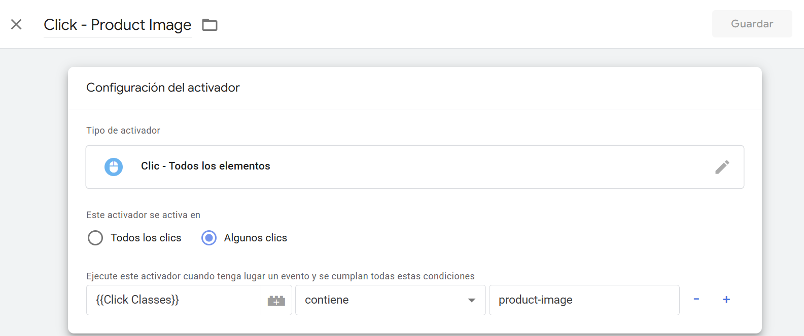

#### Activador: Click - View Product Button

Para el evento `select_item` cuando el usuario hace clic en el botón "View Product":

- **Nombre**: `Click - View Product Button`
- **Tipo**: Clic - Todos los elementos
- **Se activa en**: Algunos clics
- **Condiciones**:
 - Campo: `{{Click Text}}`
 - Operador: `contiene`
 - Valor: `View Product`

Este activador captura clics en los botones "View Product" que aparecen en la página de listado `/products`, identificándolos por el texto que contienen.

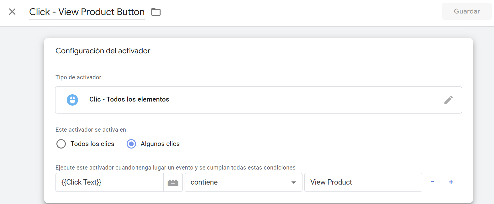

### Etiquetas GA4

#### Etiqueta: GA4 - View Item

- **Nombre**: `GA4 - View Item`
- **Tipo**: Evento de Google Analytics 4
- **ID de medición**: `{{GA4 Measurement ID}}`
- **Nombre del evento**: `view_item`

**Parámetros del evento**:
- `currency`: `{{ecommerce.currency}}`
- `value`: `{{ecommerce.value}}`
- `items`: `{{ecommerce.items}}`
- `item_name`: `{{ecommerce.items.0.item_name}}`

**Activadores**:
- `Custom Event - View Item`

Esta etiqueta se dispara automáticamente cuando un usuario carga una página de producto individual. Los parámetros enviados siguen las especificaciones de Enhanced Ecommerce de GA4.

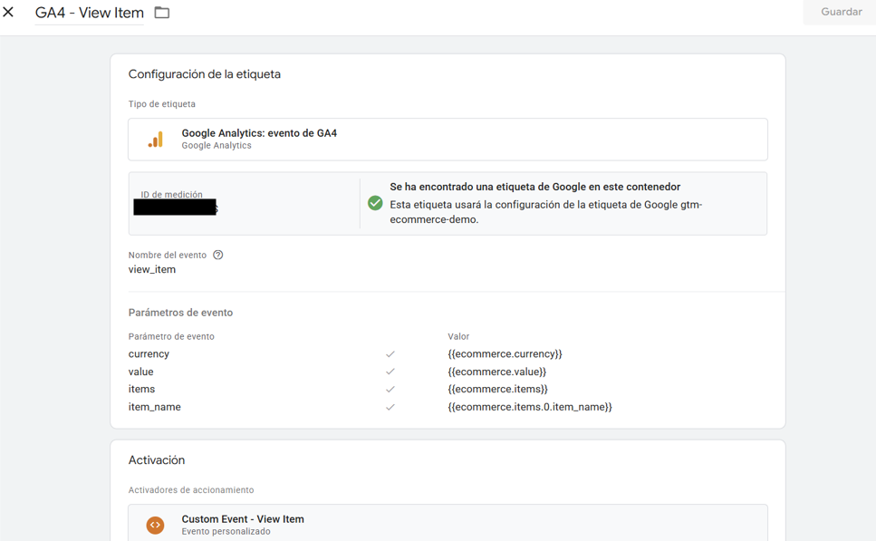

#### Etiqueta: GA4 - Select Item

- **Nombre**: `GA4 - Select Item`
- **Tipo**: Evento de Google Analytics 4
- **ID de medición**: `{{GA4 Measurement ID}}`
- **Nombre del evento**: `select_item`

**Parámetros del evento**:
- `interaction_source`: `{{Click Source}}`
- `currency`: `{{ecommerce.currency}}`
- `value`: `{{ecommerce.value}}`
- `item_name`: `{{ecommerce.items.0.item_name}}`
- `items`: `{{ecommerce.items}}`


**Activadores**:
- `Click - Product Image`
- `Click - View Product Button`

El parámetro adicional `interaction_source` permite analizar qué tipo de elemento genera mayor engagement, proporcionando insights para optimización de UX.

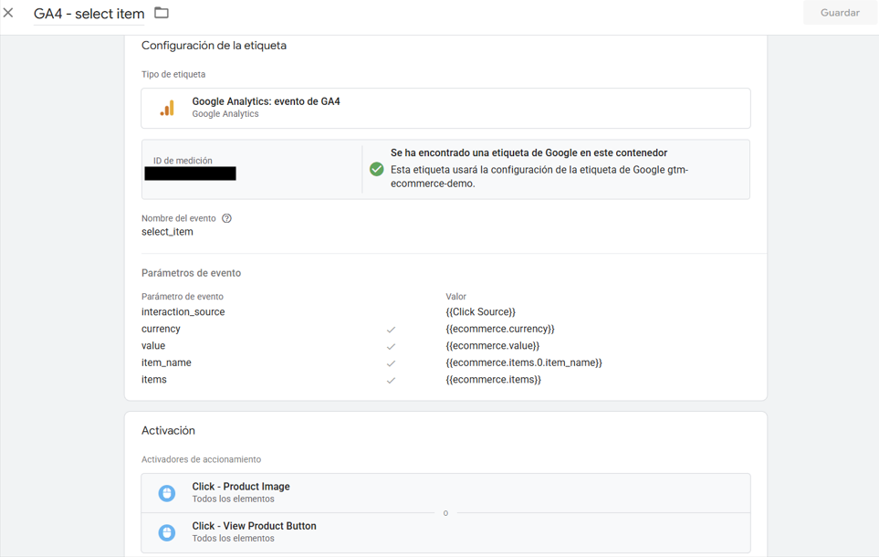

## Testing y validación

### Configuración de vista previa

1. En GTM → Botón **"Vista previa"** (esquina superior derecha)
2. URL de prueba: `https://gtm-ecommerce-demo.ew.r.appspot.com/`
3. Hacer clic en **"Connect"**

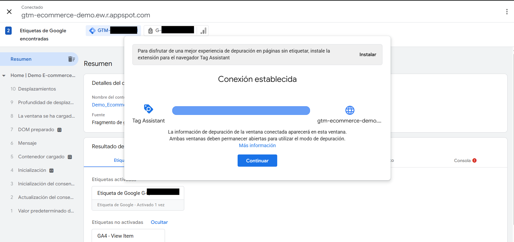

### Escenarios de prueba

#### Escenario 1: Navegación completa hasta producto
1. Navegar a: `https://gtm-ecommerce-demo.ew.r.appspot.com/`
2. Aceptar cookies en el banner de consentimiento
3. Hacer clic en **"Products"** en el menú de navegación
4. Hacer clic en cualquier producto (imagen o botón)

**Comprobaciones en GTM Preview:**
- ✅ **Etiqueta**: "GA4 - Select Item" y "GA4 - View Item" aparecen como "Fired"
- ✅ **Variables**: `Click Source`, `ecommerce.currency`, `ecommerce.value` muestran valores correctos

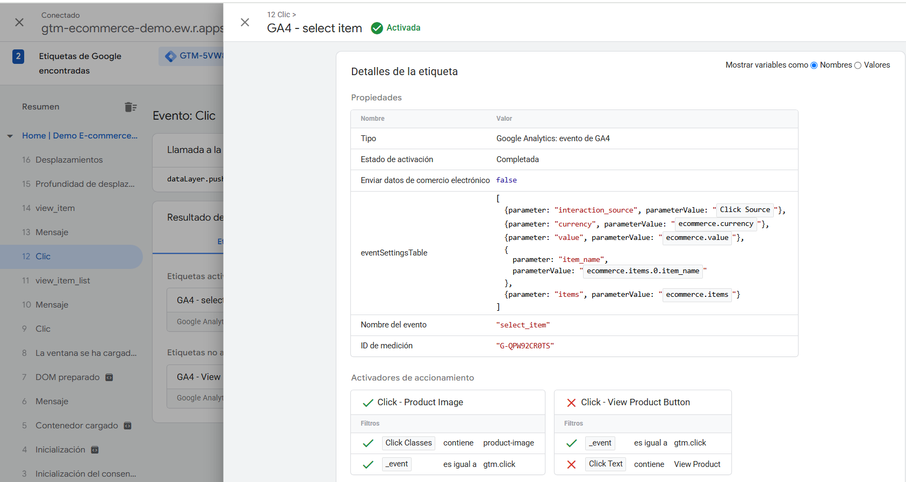

#### Escenario 2: Interacción específica con imagen de producto
1. Navegar a: `https://gtm-ecommerce-demo.ew.r.appspot.com/`
2. Aceptar cookies en el banner de consentimiento
3. Hacer clic en **"Products"** en el menú de navegación
4. Hacer clic específicamente en la **imagen** de cualquier producto

**Comprobaciones en GTM Preview:**
- ✅ **Etiqueta**: "GA4 - Select Item" se dispara correctamente
- ✅ **Variables**: `Click Source` muestra "product_image", variables de ecommerce contienen datos del producto

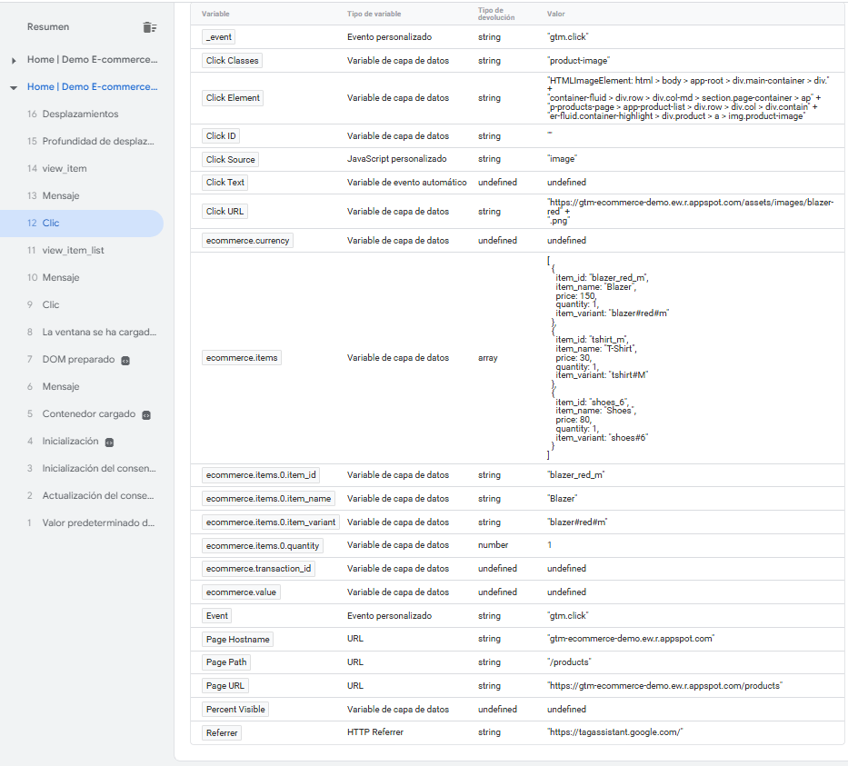

#### Escenario 3: Interacción específica con botón "View Product"
1. Navegar a: `https://gtm-ecommerce-demo.ew.r.appspot.com/`
2. Aceptar cookies en el banner de consentimiento
3. Hacer clic en **"Products"** en el menú de navegación
4. Hacer clic específicamente en el **botón "View Product"** de cualquier producto

**Comprobaciones en GTM Preview:**
- ✅ **Etiqueta**: "GA4 - Select Item" se dispara correctamente
- ✅ **Variables**: `Click Source` muestra "view_button", variables de ecommerce contienen datos del producto

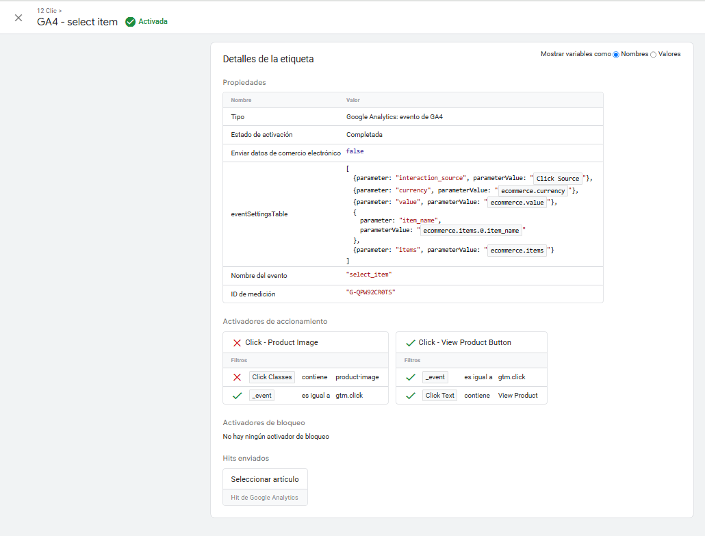

### Verificaciones en GTM Preview

#### Para View Item:
- ✅ Se dispara automáticamente al cargar página `/product/*`
- ✅ Variables se cargan correctamente:
  - `ecommerce.currency`: GBP
  - `ecommerce.value`: 30 (o precio correspondiente)
  - `ecommerce.items.0.item_name`: T-Shirt/Shoes/Blazer
- ✅ Etiqueta "GA4 - View Item" se marca como "Fired"

#### Para Select Item:
- ✅ Se dispara al hacer clic en imagen del producto
- ✅ Se dispara al hacer clic en botón "View Product"  
- ✅ Variable `Click Source` distingue correctamente:
  - `product_image` para clics en imagen
  - `view_button` para clics en botón
- ✅ Etiqueta "GA4 - Select Item" se marca como "Fired"

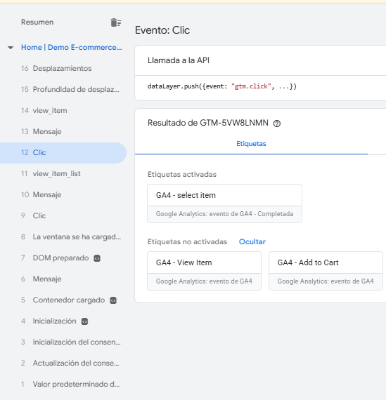

### Verificación en GA4

#### Informes en tiempo real
1. Acceder a GA4 → **Informes** → **Tiempo real**
2. Realizar las pruebas siguiendo los escenarios descritos
3. Verificar que aparecen los eventos:
   - `view_item` (al cargar páginas de producto)
   - `select_item` (al hacer clic desde lista)

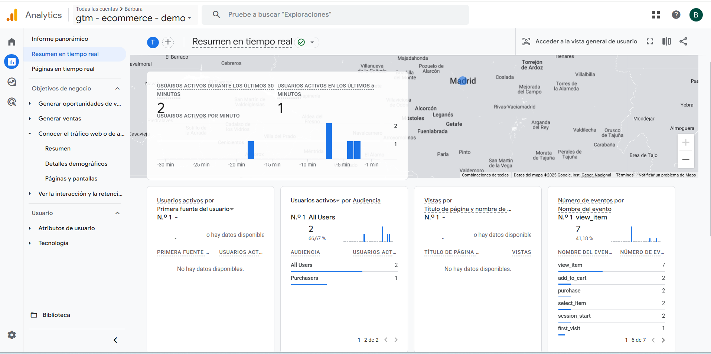

#### Verificación de parámetros por evento

**Para verificar view_item:**
1. Hacer clic en el evento `view_item` en la lista
2. Verificar que aparecen los parámetros:
  - `currency` (debe coincidir con la moneda del producto)
  - `value` (debe coincidir con el precio del producto)  
  - `item_name` (debe coincidir con el nombre del producto)

**Para verificar select_item:**
1. Hacer clic en el evento `select_item` en la lista
2. Verificar que aparecen los parámetros:
  - `currency` (debe coincidir con la moneda del producto)
  - `value` (debe coincidir con el precio del producto)
  - `item_name` (debe coincidir con el nombre del producto)
  - `interaction_source` (debe mostrar `product_image` o `view_button` según el tipo de clic)

## Resolución de problemas comunes

### Variables vacías
**Causa**: Las variables de ecommerce solo se populan cuando existe el evento correspondiente en el dataLayer.

**Solución**: 
1. Verificar que el evento `view_item` existe en el dataLayer de la página de producto
2. Confirmar que las variables están configuradas con la versión 2 de dataLayer
3. Asegurar que los nombres de variables coinciden exactamente con la estructura del dataLayer

### Activadores no se disparan
**Verificación**:
1. Inspeccionar elementos HTML para confirmar las clases CSS actuales
2. Verificar que las condiciones del activador coinciden con los elementos reales
3. Usar GTM Preview para depurar en tiempo real y verificar valores de variables incorporadas

### Eventos duplicados
Si aparecen eventos duplicados, verificar que no existen múltiples contenedores GTM o implementaciones conflictivas en la página.


## Proceso de publicación

### Pasos para publicar la configuración

1. **Salir del modo Preview**: Hacer clic en "Salir del modo de vista previa" en GTM
2. **Crear versión**: Botón **"Enviar"** en la esquina superior derecha
3. **Configurar la versión**:
   - **Nombre de la versión**: `Implementación View Item y Select Item`
   - **Descripción de la versión**:
   ```
   - Añadidas etiquetas GA4 para eventos view_item y select_item
   - Configuradas variables de ecommerce (currency, value, item_name)
   - Implementada variable Click Source para distinguir origen de interacción
   - Creados activadores para eventos automáticos y clics en productos
   - Validado funcionamiento en páginas de producto y listado
   ```
4. **Publicar**: Hacer clic en **"Publicar"**

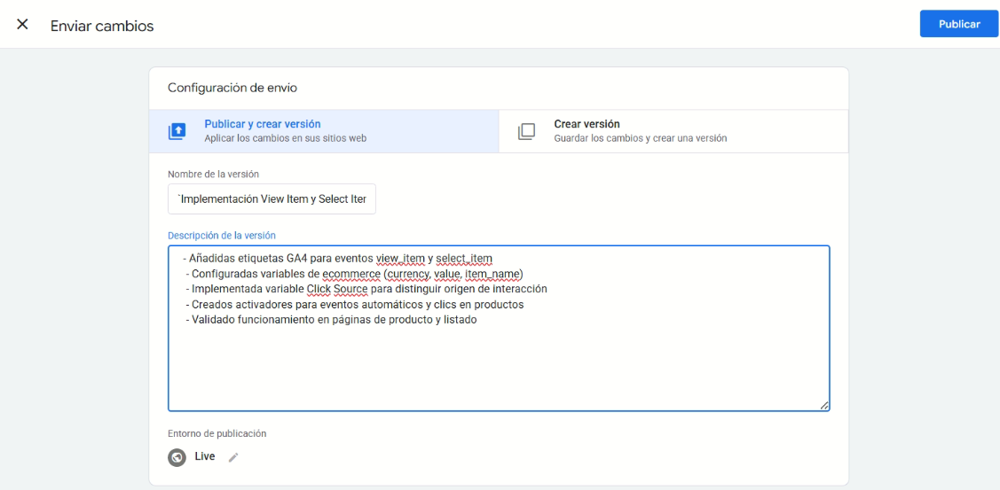

### Verificación post-publicación

Una vez publicada la versión:

- **Quitar parámetros de preview** de la URL del sitio
- **Repetir escenarios de prueba** sin modo preview activo
- **Verificar en GA4 tiempo real** que los eventos siguen llegando
- **Confirmar que no hay errores** en la consola del navegador

La implementación estará ahora activa para todos los usuarios del sitio web.

## Métricas de análisis disponibles

Con esta implementación se pueden generar análisis sobre:

- **Productos más visualizados** (frecuencia de `view_item`)
- **Productos que generan mayor interés** (frecuencia de `select_item`)  
- **Método de acceso preferido** (análisis de `interaction_source`)
- **Tasa de conversión desde lista a visualización** (ratio `select_item` vs `view_item`)
- **Patrones de navegación del usuario** (secuencia de eventos por sesión)